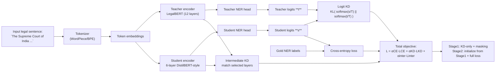

# Compressing LegalBERT via Knowledge Distillation for Legal NER

This repository contains the code and experiments for the course project:

> **Compressing LegalBERT via Knowledge Distillation for Legal NER**

We aim to build a **compact Transformer model** that distills knowledge from a full **LegalBERT** teacher while maintaining strong performance on **legal-domain Named Entity Recognition (NER)**.

- **Teacher model**: 12-layer, domain-pretrained **LegalBERT**  
- **Student model**: 6-layer BERT-style encoder (DistilBERT / TinyBERT-inspired)  
- **Task**: InLegalNER — court names, statutes, precedent citations, legal concepts  
- **Objectives**:
  - Reduce model size  
  - Improve inference efficiency  
  - Maintain high legal-domain NER accuracy  

We combine:

- **Supervised CE loss** on gold labels  
- **Logit distillation loss** with temperature scaling  
- **Intermediate-layer distillation**  
- **Multi-stage training and data augmentation**  

The repository implements the **full pipeline**: dataset processing, teacher training, student distillation, evaluation, and result visualization.

# Model Architecture: Knowledge Distillation Framework



---


# Table of Contents

- [1. Project Structure](#1-project-structure)
- [2. Environment Setup](#2-environment-setup)
  - [2.1 Create environment](#21-create-environment)
  - [2.2 Install PyTorch](#22-install-pytorch)
  - [2.3 Install remaining dependencies](#23-install-remaining-dependencies)
- [3. Dataset & Preprocessing](#3-dataset--preprocessing)
  - [3.1 InLegalNER format](#31-inlegalner-format)
  - [3.2 Dataset Implementation](#32-dataset-implementation)
  - [3.3 Quick Sanity Test](#33-quick-sanity-test)
  - [3.4 Download Script (HuggingFace Gated Dataset)](#34-download-script-huggingface-gated-dataset)
- [4. LegalBERT Teacher Model](#4-legalbert-teacher-model)
  - [4.1 Implementation](#41-implementation)
  - [4.2 Training the Teacher](#42-training-the-teacher)
- [5. Knowledge-Distilled Student Model (Single-Teacher)](#5-knowledge-distilled-student-model-single-teacher)
  - [5.1 Base KD Implementation (KD-v1)](#51-base-kd-implementation-kd-v1)
  - [5.2 KD Training Script](#52-kd-training-script)
- [6. Experimental Results (InLegalNER)](#6-experimental-results-inlegalner)
  - [6.1 Overall Performance Comparison](#61-overall-performance-comparison)
  - [6.2 KD-v1 — Logit-Only Distillation (Baseline)](#62-kd-v1--logit-only-distillation-baseline)
  - [6.3 KD-v2 — Logits + Intermediate-Layer Distillation](#63-kd-v2--logits--intermediate-layer-distillation)
  - [6.4 KD-v3 Stage1 — Unsupervised KD with Masking Augmentation](#64-kd-v3-stage1--unsupervised-kd-with-masking-augmentation)
  - [6.5 KD-v3 Stage2 — CE + KD + Intermediate (with Stage1 Init)](#65-kd-v3-stage2--ce--kd--intermediate-with-stage1-init)
  - [6.6 Multi-Teacher KD — Distilling from Two LegalBERT Teachers](#66-multi-teacher-kd--distilling-from-two-legalbert-teachers)
  - [6.7 Summary of All KD Strategies](#67-summary-of-all-kd-strategies)
- [7. Visualization & Analysis](#7-visualization--analysis)
  - [7.1 Teacher vs Best Student — F1 and Parameter Comparison](#71-teacher-vs-best-student--f1-and-parameter-comparison)
  - [7.2 F1 per Parameter — Efficiency View](#72-f1-per-parameter--efficiency-view)
  - [7.3 Accuracy–Size Trade-off](#73-accuracy–size-trade-off)
  - [7.4 Progressive KD Improvements](#74-progressive-kd-improvements)
  - [7.5 Relative Performance vs Teacher](#75-relative-performance-vs-teacher)
  - [7.6 Overall Test F1 Comparison](#76-overall-test-f1-comparison)
- [8. Conclusion & Future Work](#8-conclusion--future-work)
  - [Key Findings](#key-findings)
  - [Recommended Model for Deployment](#recommended-model-for-deployment)
  - [Future Directions](#future-directions)


## 1. Project Structure

```
legalbert-kd-ner/
├── configs/                  # Optional config files
├── data/
│   ├── raw/inlegalner/      # CoNLL-style dataset
│   └── processed/
├── logs/                    
├── outputs/
│   ├── checkpoints/         # teacher / student ckpts
│   ├── figures/             # plots for report
│   └── metrics/             # JSON metric dumps
├── results/                 # Final JSON metrics per experiment
├── scripts/
│   ├── train_teacher.py
│   ├── train_student_kd.py              # KD-v1
│   ├── train_student_kd_v2.py           # KD-v2 (logits + inter + CE)
│   ├── train_student_kd_v3.py           # KD-v3 (Stage1 + Stage2)
│   ├── train_student_kd_multiteacher.py # multi-teacher KD
│   ├── analyze_kd_results.py            # summary table
│   ├── plot_kd_summary.py               # visualization
│   └── download_inlegalner.py
├── src/
│   ├── data/
│   │   ├── inlegalner_dataset.py
│   │   └── datamodule_legalner.py
│   └── models/
│       ├── legalbert_ner_module.py
│       ├── student_kd_module.py         # KD-v1
│       ├── student_kd_v2_module.py      # KD-v2
│       ├── student_kd_v3_stage1_module.py
│       ├── student_kd_v3_stage2_module.py
│       └── student_kd_multiteacher_module.py
├── requirements.txt
└── README.md
```

## 2. Environment Setup

### 2.1 Create environment

```
conda create -n legalbert_kd python=3.10 -y
conda activate legalbert_kd
```

### 2.2 Install PyTorch

GPU example (CUDA 12.1):

```pip install torch torchvision torchaudio --index-url https://download.pytorch.org/whl/cu121```

CPU version:

```pip install torch torchvision torchaudio```

### 2.3 Install remaining dependencies

```
pip install "transformers>=4.44.0" "datasets>=2.20.0" "accelerate>=0.33.0"
pip install "pytorch-lightning>=2.4.0"
pip install "seqeval>=1.2.2" "scikit-learn>=1.3.0"
pip install "matplotlib>=3.8.0" "pandas>=2.0.0"
pip install "tqdm>=4.66.0" "pyyaml>=6.0.0" "rich>=13.7.0"
```

Or simply:

```pip install -r requirements.txt```

## 3. Dataset & Preprocessing

### 3.1 InLegalNER format

This project expects data in CoNLL-style format:

```
TOKEN   TAG
...
India   I-PRECEDENT
,       O
```

Directory layout:

```
data/raw/inlegalner/
  ├── train.conll
  ├── dev.conll
  └── test.conll
```

### 3.2 Dataset Implementation

The dataset loading and preprocessing pipeline is implemented in:

```
src/data/inlegalner_dataset.py
src/data/datamodule_legalner.py
```

#### **`inlegalner_dataset.py`**

Provides the core utilities for loading and encoding the CoNLL-format dataset:

- **`read_conll_file`**  
  Loads token sequences and BIO tags from the `.conll` files.

- **`build_label_vocab`**  
  Builds `label2id` and `id2label` mappings from all labels in the dataset.

- **`InLegalNERDataset` class**  
  Handles:
  - HuggingFace tokenizer encoding  
  - Subword → token label alignment  
  - Masks non-first subword labels with `-100` (so CE ignores them)  
  - Returns:
    - `input_ids`
    - `attention_mask`
    - `labels`

This ensures compatibility with BERT-style tokenization and PyTorch Lightning training loops.

---

#### **`datamodule_legalner.py`**

Implements the PyTorch Lightning DataModule:

- **`train_dataloader`**
- **`val_dataloader`**
- **`test_dataloader`**

Also includes a **custom `collate_fn`** that prevents the common PyTorch error:

RuntimeError: resize storage not resizable

This avoids issues when dynamically padding sequences of variable length and ensures stable training inside Lightning.

---

### 3.3 Quick Sanity Test

After setting up the environment and placing the data under `data/raw/inlegalner/`, you can quickly verify that the dataloader works:

```
from src.data.datamodule_legalner import LegalNERDataModule

dm = LegalNERDataModule(
    data_dir="data/raw/inlegalner",
    pretrained_model_name="nlpaueb/legal-bert-base-uncased",
)
dm.prepare_data()
dm.setup("fit")

batch = next(iter(dm.train_dataloader()))
print(batch["input_ids"].shape)   # e.g. (4, 256)
print(batch["labels"].shape)
```

If this runs without errors and prints reasonable tensor shapes, the dataset + tokenizer pipeline is correctly configured.

### 3.4 Download Script (HuggingFace Gated Dataset)

The project uses the InLegalNER dataset hosted on HuggingFace:

- Dataset: ```opennyaiorg/InLegalNER```

After you accept access to the dataset on HuggingFace, run:

```python scripts/download_inlegalner.py```

This script will create:

```
data/raw/inlegalner/train.conll
data/raw/inlegalner/dev.conll
data/raw/inlegalner/test.conll
```

These files are then consumed by the dataset and datamodule classes described above.

## 4. LegalBERT Teacher Model

### 4.1 Implementation

The LegalBERT NER teacher is implemented in:

- `src/models/legalbert_ner_module.py`

This Lightning module wraps:

- `AutoModelForTokenClassification` (HuggingFace transformers)
- Cross-entropy loss for token classification
- `seqeval` macro F1 for sequence-level evaluation
- Logging of:
  - `train_loss`, `val_loss`, `test_loss`
  - `train_f1`, `val_f1`, `test_f1`

The module is designed to be **plug-and-play** for other BERT-style encoders if needed.

---

### 4.2 Training the Teacher

Example command:

```
python scripts/train_teacher.py \
  --data_dir data/raw/inlegalner \
  --output_dir outputs/checkpoints/teacher_legalbert \
  --batch_size 16 \
  --max_epochs 5 \
  --pretrained_model_name ggomarr/legal-bert-base-uncased-safetensors
```

After training, the script:

1. Selects the **best checkpoint** according to val_f1

2. Runs trainer.test(ckpt_path="best")

3. Saves the final metrics to: results/teacher_legalbert_inlegalner_test.json

Example JSON:

```
{
  "experiment": "teacher_legalbert",
  "batch_size": 16,
  "max_epochs": 5,
  "learning_rate": 5e-5,
  "test_metrics": {
    "test_loss": 0.14,
    "test_f1": 0.7807
  }
}
```

## 5. Knowledge-Distilled Student Model (Single-Teacher)

### 5.1 Base KD Implementation (KD-v1)

The baseline single-teacher KD model is implemented in:

- `src/models/student_kd_module.py`

Key components:

- **Student encoder**: `distilbert-base-uncased` (6 layers)
- **Teacher encoder**: LegalBERT loaded from the **finetuned** checkpoint and frozen

The loss combines supervised CE and logit-based KD:

\[
\mathcal{L}
=
\alpha_{\text{CE}} \cdot \mathcal{L}_{\text{CE}}(\text{student}, y)
+
\alpha_{\text{KD}} \cdot T^2 \cdot
\mathrm{KL}\!\left(
\operatorname{softmax}(s/T)
\;\big\|\;
\operatorname{softmax}(t/T)
\right),
\]

where:

- \(s\): student logits  
- \(t\): teacher logits  
- \(T\): temperature  

**KD hyperparameters (KD-v1):**

- `alpha_ce = 1.0`
- `alpha_kd = 1.0`
- `temperature = 2.0`

**Logged metrics:**

- Losses: `train_loss`, `val_loss`, `test_loss`
- F1 scores: `train_f1`, `val_f1`, `test_f1`

---

### 5.2 KD Training Script

Typical command (using the trained LegalBERT teacher checkpoint):

```
python scripts/train_student_kd.py \
  --data_dir data/raw/inlegalner \
  --teacher_model_name ggomarr/legal-bert-base-uncased-safetensors \
  --teacher_ckpt outputs/checkpoints/teacher_legalbert/teacher-legalbert-epoch=02-val_f1=0.8061.ckpt \
  --student_model_name distilbert-base-uncased \
  --output_dir outputs/checkpoints/student_kd_distilbert \
  --batch_size 16 \
  --max_epochs 5 \
  --alpha_ce 1.0 \
  --alpha_kd 1.0 \
  --temperature 2.0 \
  --precision 16-mixed
```

After training, the script runs:

- trainer.test(ckpt_path="best")

and writes metrics to:

```results/student_kd_distilbert_inlegalner_test.json```

This JSON file can be directly compared with the teacher metrics JSON
(e.g., ```results/teacher_legalbert_inlegalner_test.json```).

## 6. Experimental Results (InLegalNER)

We evaluate several knowledge-distillation strategies to compress a **12-layer LegalBERT teacher (108M parameters)** into a **6-layer DistilBERT-style student (66.4M parameters)**.

We progressively strengthen supervision and data augmentation to study how each component contributes to final student quality.

---

### 6.1 Overall Performance Comparison

| Model / Version                         | Params | Test F1  | % of Teacher | Notes                                              |
|-----------------------------------------|--------|----------|--------------|----------------------------------------------------|
| **LegalBERT Teacher**                   | 108M   | 0.7807   | 100%         | 12-layer finetuned LegalBERT                       |
| **KD-v3 Stage2 (best student)**         | 66.4M  | 0.6361   | 81.5%        | Full KD (CE + logits + inter), init from Stage1   |
| **KD-v3 Stage1**                        | 66.4M  | 0.5297   | 67.9%        | Unsupervised KD + masking ×10                      |
| **KD-v2 (logits + intermediate + CE)**  | 66.4M  | 0.5222   | 66.9%        | Hidden-state MSE + logit KD                        |
| **Multi-Teacher KD (2 teachers)**       | 66.4M  | 0.5178   | 66.3%        | Weighted ensemble teacher logits/intermediate      |
| **KD-v1 (logits only)**                 | 66.4M  | 0.5122   | 65.6%        | Pure KL on logits                                  |

**Parameter reduction**

- 108M → 66.4M (**−39% parameters**)

**Performance retention**

- KD-v3 Stage2 keeps **≈81.5%** of teacher F1 (0.6361 / 0.7807).

Metrics are stored for reproducibility in:

- `results/teacher_legalbert_inlegalner_test.json`
- `results/student_kd_distilbert_inlegalner_test.json`
- `results/student_kd_v2_distilbert_inter_inlegalner_test.json`
- `results/student_kd_v3_stage1_inlegalner_test.json`
- `results/student_kd_v3_stage2_inlegalner_test.json`
- `results/student_kd_multiteachers_inlegalner_test.json`

---

### 6.2 KD-v1 — Logit-Only Distillation (Baseline)

The simplest form of KD minimizes:

\[
\mathcal{L}_{\text{KD}}
=
T^2 \cdot
\mathrm{KL}\!\left(
\operatorname{softmax}(s/T)
\,\big\|\,
\operatorname{softmax}(t/T)
\right),
\]

where:

- \(s\): student logits  
- \(t\): teacher logits  
- \(T\): temperature  

Settings for KD-v1:

- **No CE loss**
- **No intermediate loss**
- **No augmentation**
- Temperature: \(T = 2\)

**Result:**  
- **0.5122** test F1 (**65.6%** of teacher)

Logit KD alone provides a reasonable baseline but cannot fully transfer deeper linguistic patterns from LegalBERT.

---

### 6.3 KD-v2 — Logits + Intermediate-Layer Distillation

We extend KD with **hidden-state alignment**:

- **Teacher**: 12 Transformer layers  
- **Student**: 6 Transformer layers  
- **Layer mapping:**
  - Teacher layers \([2, 4, 6, 8, 10, 12]\)
  - Student layers \([1, 2, 3, 4, 5, 6]\)

Intermediate loss:

\[
\mathcal{L}_{\text{inter}}
=
\frac{1}{6}\sum_i
\left\|
h^s_i - h^t_i
\right\|_2^2,
\]

Total loss:

\[
\mathcal{L}
=
\alpha_{\text{CE}} \mathcal{L}_{\text{CE}}
+
\alpha_{\text{KD}} \mathcal{L}_{\text{KD}}
+
\alpha_{\text{inter}} \mathcal{L}_{\text{inter}}.
\]

**Result:**  
- **0.5222** test F1 (**66.9%** of teacher)  
- ≈ +1 point absolute over KD-v1

Intermediate supervision from hidden states helps the compressed model learn more structured representations.

**Training command**

```
python scripts/train_student_kd_v2.py \
  --data_dir data/raw/inlegalner \
  --teacher_model_name ggomarr/legal-bert-base-uncased-safetensors \
  --teacher_ckpt outputs/checkpoints/teacher_legalbert/teacher-legalbert-epoch=02-val_f1=0.8061.ckpt \
  --student_model_name distilbert-base-uncased \
  --output_dir outputs/checkpoints/student_kd_v2_distilbert_inter \
  --batch_size 16 \
  --max_length 256 \
  --max_epochs 5 \
  --num_workers 0 \
  --learning_rate 5e-5 \
  --weight_decay 0.01 \
  --warmup_ratio 0.1 \
  --alpha_ce 1.0 \
  --alpha_kd 1.0 \
  --alpha_inter 1.0 \
  --temperature 2.0 \
  --precision 16-mixed
```

One-line version:

```
python scripts/train_student_kd_v2.py --data_dir data/raw/inlegalner --teacher_model_name ggomarr/legal-bert-base-uncased-safetensors --teacher_ckpt outputs/checkpoints/teacher_legalbert/teacher-legalbert-epoch=02-val_f1=0.8061.ckpt --student_model_name distilbert-base-uncased --output_dir outputs/checkpoints/student_kd_v2_distilbert_inter --batch_size 16 --max_length 256 --max_epochs 5 --num_workers 0 --learning_rate 5e-5 --weight_decay 0.01 --warmup_ratio 0.1 --alpha_ce 1.0 --alpha_kd 1.0 --alpha_inter 1.0 --temperature 2.0 --precision 16-mixed
```

### 6.4 KD-v3 Stage1 — Unsupervised KD with Masking Augmentation

KD-v3 Stage1 further improves KD by adding **data augmentation** and **removing CE loss**.

**Stage1 setup**

- Logit KD  
- Intermediate-layer KD  
- **No CE** (gold labels only used for evaluation)  
- **10× masking-based augmentation** on `input_ids`  
  → BERT-style `[MASK]` noise per batch  

**Intuition**

The student must imitate the teacher under many **noisy views** of the same legal sentence, which improves robustness.

**Result**

- **0.5297** test F1 (**67.9%** of teacher)  
- Best performance among all **CE-free** KD variants  

The best **Stage1** checkpoint is used to initialize **KD-v3 Stage2**.

---

### 6.5 KD-v3 Stage2 — CE + KD + Intermediate (with Stage1 Init)

KD-v3 Stage2 is the **full distillation pipeline**, combining supervised CE with KD signals and warm-starting the student from Stage1.

**Procedure**

1. Initialize the student from the **Stage1 checkpoint**
2. Optimize a combined objective:
   - Cross-entropy on gold labels  
   - Logit KD (temperature \(T\))  
   - Intermediate-layer KD (same mapping as KD-v2)

**Stage2 loss**

\[
\mathcal{L}_{\text{stage2}}
=
\alpha_{\text{CE}} \mathcal{L}_{\text{CE}}
+ \alpha_{\text{KD}} \mathcal{L}_{\text{KD}}
+ \alpha_{\text{inter}} \mathcal{L}_{\text{inter}}.
\]

**Result**

- **0.6361** test F1 (**81.5%** of teacher)  
- **+11.4 points** over KD-v2 (0.5222 → 0.6361)  
- Uses **39% fewer parameters** than the teacher  
- **Strongest student** in all experiments  

**Training command**

```
python scripts/train_student_kd_v3.py \
  --data_dir data/raw/inlegalner \
  --teacher_model_name ggomarr/legal-bert-base-uncased-safetensors \
  --teacher_ckpt outputs/checkpoints/teacher_legalbert/teacher-legalbert-epoch=02-val_f1=0.8061.ckpt \
  --student_model_name distilbert-base-uncased \
  --student_init_ckpt outputs/checkpoints/student_kd_v3_stage1/student-kd-stage1-v3-epoch=04-val_f1=0.5358.ckpt \
  --output_dir outputs/checkpoints/student_kd_v3_stage2 \
  --batch_size 16 \
  --max_length 256 \
  --max_epochs 5 \
  --num_workers 0 \
  --learning_rate 5e-5 \
  --weight_decay 0.01 \
  --warmup_ratio 0.1 \
  --temperature 2.0 \
  --alpha_ce 1.0 \
  --alpha_kd 1.0 \
  --alpha_inter 1.0 \
  --alpha_soft 1.0 \
  --precision 16-mixed
```

One-line version:

```
python scripts/train_student_kd_v3.py --data_dir data/raw/inlegalner --teacher_model_name ggomarr/legal-bert-base-uncased-safetensors --teacher_ckpt outputs/checkpoints/teacher_legalbert/teacher-legalbert-epoch=02-val_f1=0.8061.ckpt --student_model_name distilbert-base-uncased --student_init_ckpt outputs/checkpoints/student_kd_v3_stage1/student-kd-stage1-v3-epoch=04-val_f1=0.5358.ckpt --output_dir outputs/checkpoints/student_kd_v3_stage2 --batch_size 16 --max_length 256 --max_epochs 5 --num_workers 0 --learning_rate 5e-5 --weight_decay 0.01 --warmup_ratio 0.1 --temperature 2.0 --alpha_ce 1.0 --alpha_kd 1.0 --alpha_inter 1.0 --alpha_soft 1.0 --precision 16-mixed
```

### 6.6 Multi-Teacher KD — Distilling from Two LegalBERT Teachers

We also explore **multi-teacher KD**, where the student learns from an ensemble of **two teachers**:

- **Teacher 1:** finetuned LegalBERT checkpoint  
- **Teacher 2:** `nlpaueb/legal-bert-base-uncased` (safetensors)

For each batch, we:

1. Compute logits & hidden states of both teachers  
2. Compute a weighted average of teacher logits  
3. Compute a weighted average of teacher hidden states  
4. Apply the same distillation losses as KD-v2:
   - Cross-entropy (CE)  
   - Logit KD  
   - Intermediate-layer KD (same mapping as KD-v2)  

**Result**

- **0.5178** test F1 (**66.3% of teacher**)

**Insight**

Multi-teacher KD stabilizes supervision but does **not** surpass KD-v3 Stage2 — likely because the second teacher is weaker than the finetuned LegalBERT.

---

### 6.7 Summary of All KD Strategies

| Version          | Supervision                           | Augmentation   | Stage | Test F1 |
|------------------|----------------------------------------|----------------|-------|---------|
| **KD-v1**        | Logits only                            | ✗              | 1     | 0.5122  |
| **KD-v2**        | CE + logits + intermediate             | ✗              | 1     | 0.5222  |
| **KD-v3 Stage1** | Logits + intermediate (no CE)          | Masking ×10    | 1     | 0.5297  |
| **KD-v3 Stage2** | CE + logits + intermediate (full KD)   | Stage1 init    | 2     | 0.6361  |
| **Multi-Teacher**| CE + logits + intermediate (2 teachers)| ✗              | 1     | 0.5178  |

---

## 7. Visualization & Analysis

All figures below can be generated with:

```
python scripts/analyze_kd_results.py
python scripts/plot_kd_summary.py --results_dir results --output_dir outputs/figures
```

(If your file locations differ, adjust the paths in the script and the image links.)

## 7.1 Teacher vs Best Student — F1 and Parameter Comparison

### **Figure 1 — Teacher vs KD Student F1**  
`outputs/figures/f1_comparison.png`

This figure highlights the absolute performance gap between:

- **LegalBERT Teacher** — ≈ **0.7807 F1**  
- **Best KD Student (KD-v3 Stage2)** — ≈ **0.6361 F1**

The student loses roughly **0.14 absolute F1**, but is **much smaller, faster, and more efficient**.

---

### **Figure 2 — Teacher vs KD Student Parameters**  
`outputs/figures/param_comparison.png`

Parameter comparison:

- **Teacher:** 108M parameters  
- **Student:** 66.4M parameters  

This represents a **≈39% reduction in parameters**, while retaining most of the teacher’s performance.

---

## 7.2 F1 per Parameter — Efficiency View

### **Figure 3 — Efficiency: F1 per Parameter**  
`outputs/figures/kd_f1_per_param_bar.png`

Each bar shows:  
**Test F1 / parameter count (per million parameters)**  

**Observations:**

- **KD-v3 Stage2** achieves the **highest F1/param efficiency**.
- KD-v3 Stage1 and KD-v2 are slightly more efficient than KD-v1 and Multi-Teacher.
- LegalBERT achieves high absolute F1 but *poor F1-per-parameter efficiency* due to its size.

**Conclusion:**  
**KD-v3 Stage2 is both accurate and the most parameter-efficient model.**

---

## 7.3 Accuracy–Size Trade-off

### **Figure 4 — Parameters vs Test F1**  
`outputs/figures/kd_param_f1_tradeoff.png`

Each point represents a different model:

- LegalBERT sits in the **upper-right corner** (large + accurate).
- **KD-v3 Stage2** lies on a strong **Pareto frontier point**: significantly smaller but still high F1.
- KD-v1 / KD-v2 / KD-v3 Stage1 / Multi-Teacher cluster together (same size, small accuracy differences).

---

## 7.4 Progressive KD Improvements

### **Figure 5 — KD Progression Curve**  
`outputs/figures/kd_progression_line.png`

This plot tracks improvements across KD versions:

1. **KD-v1:** logit KD only  
2. **KD-v2:** + intermediate-layer MSE  
3. **KD-v3 Stage1:** + heavy masking augmentation, remove CE  
4. **KD-v3 Stage2:** + CE again, initialized from Stage1  

The dashed line highlights the teacher F1.

**Key takeaway:**  
Each step provides incremental improvement, but the **largest gain** comes from combining:  
**Stage1 initialization + CE + full KD (KD-v3 Stage2).**

---

## 7.5 Relative Performance vs Teacher

### **Figure 6 — Relative F1 (% of Teacher)**  
`outputs/figures/kd_relative_f1_bar.png`

- **KD-v3 Stage2 recovers ≈81.5% of the teacher F1**
- Other students recover **≈65–68%**
- Multi-Teacher is slightly better than KD-v1 but **still worse than KD-v2 / KD-v3**

This clearly shows that **multi-stage KD contributes more than adding extra teachers**.

---

## 7.6 Overall Test F1 Comparison

### **Figure 7 — Test F1 Bar Chart**  
`outputs/figures/kd_test_f1_bar.png`

This is the clean summary bar chart showing **absolute Test F1 scores** for:

- Teacher
- KD-v1
- KD-v2
- KD-v3 Stage1
- KD-v3 Stage2
- Multi-Teacher

This figure is typically used as the **main result summary** in the report.

---

## 8. Conclusion & Future Work

This project demonstrates that **knowledge distillation is an effective way to compress LegalBERT** for domain-specific NER tasks.

### **Key Findings**

- A **12-layer LegalBERT** teacher (108M parameters) can be compressed into a **6-layer student** (66.4M parameters), achieving a **39% reduction in model size**.
- The best distilled model, **KD-v3 Stage2**, achieves:
  - **0.6361 Test F1**
  - **≈81.5% of the teacher’s performance**
- Across all efficiency analyses, **KD-v3 Stage2 delivers the highest F1-per-parameter ratio**, making it the strongest balance of compactness and accuracy.

### **Recommended Model for Deployment**

> **KD-v3 Stage2**  
> *(CE + logits + intermediate-layer KD, initialized from KD-v3 Stage1)*  
>  
> This configuration consistently provided the best performance, stability, and efficiency.

---

## Future Directions

Several extensions can further improve model compactness and performance:

### **(1). Smaller Students**
- Distill into even lighter models such as:
  - **4-layer DistilBERT**
  - **TinyBERT**
  - **MiniLM**
- Explore architectures optimized for KD from the start.

### **(2). Advanced Intermediate-Layer Objectives**
Incorporate richer structural KD signals:
- **Attention transfer**
- **Relation distillation**
- **Contrastive KD** for better discriminative representations

### **(3). Richer Data Augmentation**
Beyond masking, explore:
- **Back-translation**
- **Paraphrasing of legal sentences**
- **Synonym replacement**
- **Entity replacement augmentation**

### **(4). Hyperparameter Sweeps**
Tune the KD configuration more extensively:
- α<sub>CE</sub>
- α<sub>KD</sub>
- α<sub>inter</sub>
- **Temperature T**

This can reveal better trade-offs between CE and KD signals.

### **(5). Combine KD with Model Compression**
More aggressive compression is possible by adding:
- **Quantization** (INT8 or INT4)
- **Pruning** (structured or unstructured)
- **Weight sharing / decomposition**

These can yield further speed-ups for deployment.

### **(6). Stronger Multi-Teacher KD**
Multi-teacher KD showed stability but not higher accuracy in the current setup.  
Future work could explore:

- Ensembles of **multiple strong LegalBERT variants**
- Diverse-domain teachers for broader generalization
- Teacher selection or weighting strategies

This may allow multi-teacher KD to surpass the best single-teacher pipeline.

---

**Overall, this project provides a strong and extensible KD pipeline for LegalBERT NER, and KD-v3 Stage2 serves as a reliable, efficient student model suitable for real-world deployment.**


